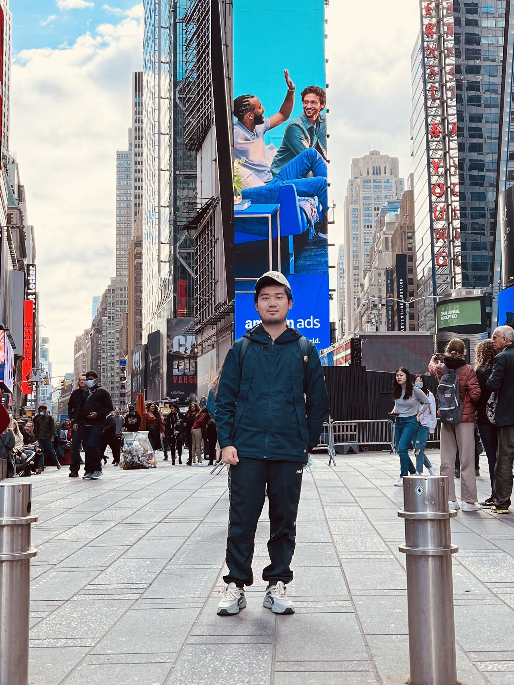

#### MS student of Biostatistics
#### Columbia University Mailman School of Public Health

{width=40%}

links to other page.
I can link to useful things like  [google](https://www.google.com/) and [p8105](https://www.p8105.com/making_websites.html)

I can make an extra page on my site and link to that.
Here's my [about](about.html)

## Here's Ted

Ted likes to be on the internet. Here he is:

e.g. [p8105](https://github.com/P8105/p8105.github.io)
